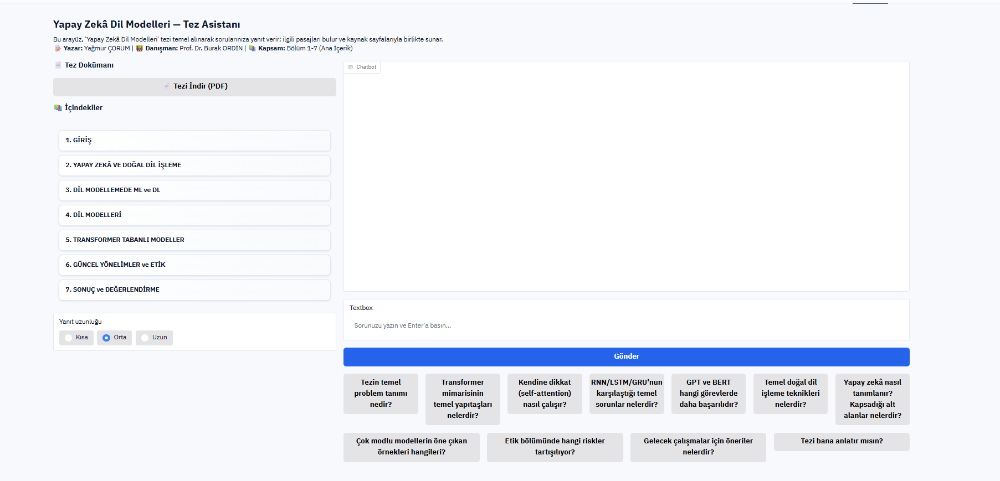
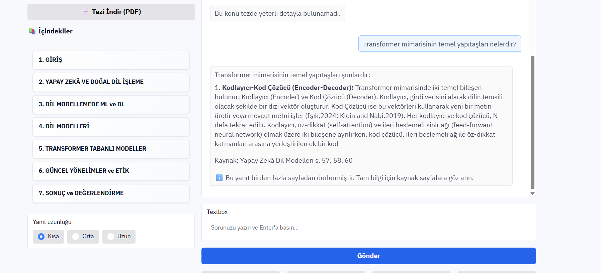
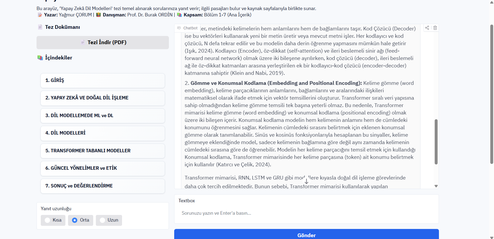
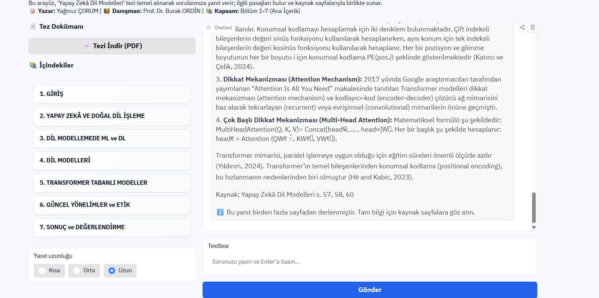
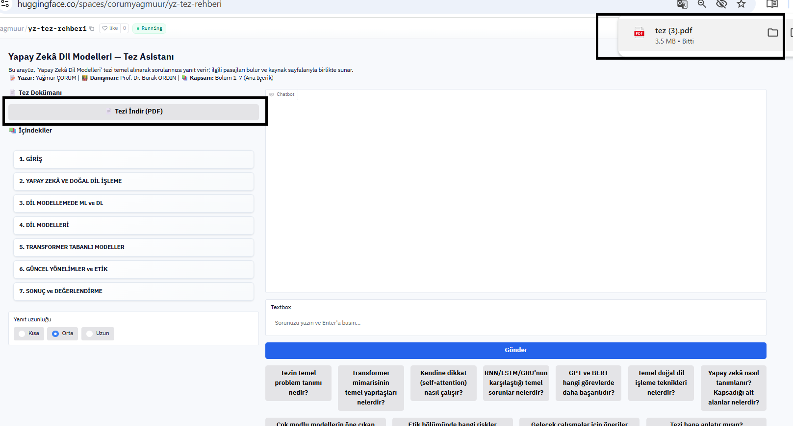
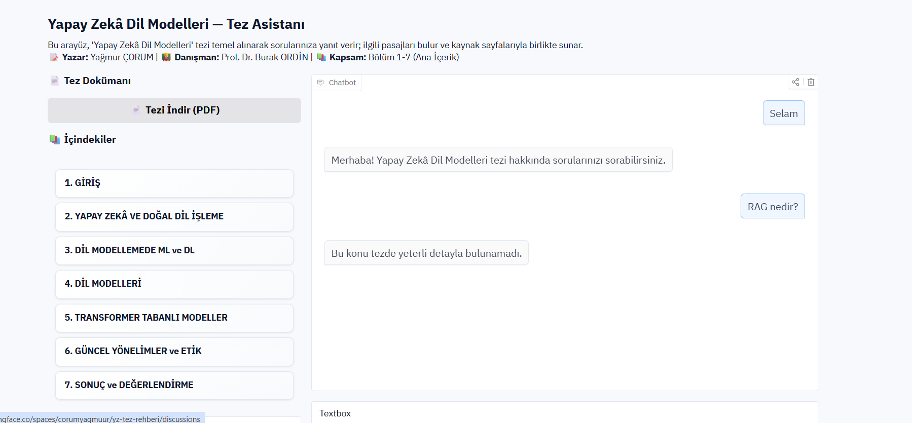

# Akıllı Tez Rehberi — RAG Chatbot

## 📋 Proje Hakkında

Bu proje, **"Yapay Zekâ Dil Modelleri"** lisans tezi üzerine geliştirilmiş bir RAG chatbot'udur. Kullanıcılar tez içeriği hakkında sorular sorabilir ve sistem, ilgili sayfa referanslarıyla birlikte detaylı yanıtlar üretir.

### 🎯 Proje Amacı
- Akademik tez içeriğini erişilebilir hale getirmek
- RAG teknolojisinin pratik uygulamasını göstermek
- Türkçe doğal dil işleme yeteneklerini sergilemek
- Kaynak referanslı, güvenilir bilgi sunmak

## 🛠️ Kullanılan Teknolojiler

### RAG Pipeline Bileşenleri
- **Embedding Model**: `trmteb/turkish-embedding-model` (Türkçe için optimize edilmiş)
- **Vector Database**: ChromaDB (kalıcı depolama)
- **Generation Model**: Google Gemini 2.0 Flash
- **Framework**: LangChain (RAG pipeline yönetimi)

### Web Arayüzü
- **UI Framework**: Gradio 4.44.0
- **Deployment**: Hugging Face Spaces
- **Styling**: Özel CSS tema ve responsive tasarım

### Veri İşleme
- **PDF Processing**: pypdf (metin çıkarma)
- **Text Chunking**: Kelime bazlı parçalama (1500 kelime, 250 overlap)
- **Data Formats**: JSONL, Parquet
- **Preprocessing**: Metin temizleme ve normalizasyon
- **Auto-ingest**: Uygulama başlangıcında otomatik veri yükleme

## 📊 Veri Seti Hazırlama

### Kaynak Veri
- **Tez**: "Yapay Zekâ Dil Modelleri" (126 sayfa PDF)
- **İçerik**: Bölüm 1-7 (Ana içerik, sayfa 13-104)
- **Dil**: Türkçe akademik metin

### Veri Hazırlama Süreci
Kaggle notebook'unda gerçekleştirilen adımlar:

1. **PDF Metin Çıkarma**
   - pypdf ile sayfa sayfa metin çıkarma
   - Bozuk karakter temizleme
   - Biçimsel normalizasyon

2. **Metin Parçalama (Chunking)**
   - Chunk size: 1500 kelime (512'den artırıldı)
   - Overlap: 250 kelime (80'den artırıldı)
   - Sayfa bazlı metadata ekleme

3. **Çıktı Formatları**
   - JSONL: RAG ingest için optimize
   - Parquet: Analiz ve kontrol için

**Veri Hazırlama Notebook**: [ak-ll-tez-rehberi-veri-haz-rlama.ipynb](./ak-ll-tez-rehberi-veri-haz-rlama.ipynb)

### Veri Yapısı
```json
{
  "content": "Metin parçası...",
  "meta": {
    "title": "Yapay Zekâ Dil Modelleri – Lisans Tezi",
    "source": "yapayzekadilmodelleri.pdf",
    "page_start": 13,
    "page_end": 13
  }
}
```

## 🏗️ Çözüm Mimarisi

### RAG Pipeline Akışı

Kullanıcı Sorusu → Embedding → Vector Search → Context Retrieval → LLM Generation → Kaynaklı Yanıt


### Teknik Mimari

┌─────────────────┐    ┌──────────────────┐    ┌─────────────────┐
│   Gradio UI     │    │   LangChain      │    │   ChromaDB      │
│                 │    │   RAG Pipeline   │    │   Vector Store  │
│ • Chat Interface│◄──►│                  │◄──►│                 │
│ • Response Ctrl │    │ • Retrieval      │    │ • Embeddings    │
│ • Source Display│    │ • Prompt Builder │    │ • Metadata      │
└─────────────────┘    └──────────────────┘    └─────────────────┘
                                │
                                ▼
                       ┌─────────────────┐
                       │   Gemini 2.0    │
                       │   Generation    │
                       │                 │
                       └─────────────────┘


### Teknoloji Seçim Gerekçeleri

**Embedding Model**: `trmteb/turkish-embedding-model`
- Türkçe için özel olarak eğitilmiş
- Akademik metin anlama yeteneği
- SentenceTransformers tabanlı

**Vector Database**: ChromaDB
- LangChain entegrasyonu
- Kalıcı depolama (.chroma klasörü)
- Hızlı similarity search

**Generation Model**: Gemini 2.0 Flash
- Türkçe üretim kalitesi
- Bağlam anlama yeteneği
- API erişim kolaylığı

## 🚀 Kurulum ve Çalıştırma

### Hugging Face Spaces (Önerilen)

**Canlı Demo**: [https://huggingface.co/spaces/corumyagmuur/yz-tez-rehberi](https://huggingface.co/spaces/corumyagmuur/yz-tez-rehberi)

#### Spaces Kurulumu
1. **Space Oluştur**
   - Type: Gradio
   - App file: `app.py`

2. **Secrets Ayarla**
   ```
   GOOGLE_API_KEY: your_gemini_api_key
   ```

3. **Variables Ayarla**
   ```
   EMBEDDINGS_MODEL: trmteb/turkish-embedding-model
   GENERATION_MODEL: gemini-2.0-flash
   CHROMA_PERSIST_DIR: .chroma
   PDF_PAGE_START: 13
   PDF_PAGE_END: 104
   PDF_TO_THESIS_OFFSET: 0
   ```

4. **Dosyaları Yükle**
   - `app.py`
   - `requirements.txt`
   - `data/` klasörü
   - 
### 📁 Proje Yapısı

yz-tez-rehberi/
├── app.py                    # Ana uygulama
├── requirements.txt          # Python bağımlılıkları
├── README.md                 # Dokümantasyon
└── data/                     # Veri dosyaları
    ├── processed_docs.jsonl
    ├── processed_docs.parquet
    └── tez.pdf
     
### 🖥️ Seçenek 2: Lokal Kurulum (Gelişmiş Kullanıcılar)
⚠️ Not: Proje Hugging Face Spaces için optimize edilmiştir. Lokal kurulumda bazı dependency sorunları yaşanabilir.

### Gereksinimler
-Python: 3.10, 3.11 veya 3.12 (🚫 3.13 önerilmez - paket uyumsuzlukları)
-Google API Key: Google AI Studio
-Windows Kullanıcıları: Visual Studio Build Tools (C++ derleyici gerekli)

### Kurulum Adımları

# 1. Repo'yu klonla
git clone https://github.com/yagmurcorum/yz-tez-rehberi.git
cd yz-tez-rehberi

# 2. Virtual environment oluştur
python -m venv venv
# Windows
venv\Scripts\activate
# macOS/Linux
source venv/bin/activate

# 3. Paketleri yükle
# Windows için (binary-only mode)
pip install --only-binary=all -r requirements.txt
# macOS/Linux için
pip install -r requirements.txt

# 4. .env dosyası oluştur
# .env dosyasını proje kök dizinine ekleyin:
GOOGLE_API_KEY=your_api_key_here
EMBEDDINGS_MODEL=trmteb/turkish-embedding-model
GENERATION_MODEL=gemini-2.0-flash
CHROMA_PERSIST_DIR=.chroma

# 5. Uygulamayı çalıştır
python app.py
Tarayıcınızda http://localhost:7860 adresine gidin.

### Bilinen Lokal Kurulum Sorunları

| **Sorun**                     | **Çözüm**                                |
| ----------------------------- | ---------------------------------------- |
| Python 3.13 uyumsuzluğu       | Python 3.10–3.12 kullanın                |
| chroma-hnswlib derleme hatası | `pip install --only-binary=all` kullanın |
| cmake bulunamadı              | CMake kurun                              |
| Visual Studio Build Tools     | VS Build Tools kurun (Windows)           |

💡 Öneri: Lokal kurulum sorunları yaşıyorsanız HF Spaces kullanın tüm dependencies önceden hazır!


### 🎮 Web Arayüzü ve Kullanım

Sohbet Arayüzü: Gerçek zamanlı soru-cevap
İçindekiler: Bölüm bazlı navigasyon
Örnek Sorular: Hazır soru butonları
Yazar/Danışman Bilgisi: Başlıkta kalıcı gösterim


Yanıt Uzunluğu Kontrolü: Kısa/Orta/Uzun seçenekleri
Kaynak Referansları: Sayfa numaralarıyla birlikte




Tez İndirme: PDF dosyasına direkt erişim


Tez içeriğinde bulunmayan bilgi sorgusu



### 📈 Elde Edilen Sonuçlar

### Başarılı Örnekler

✅ **Doğru Kaynak Referansları**: Sistem genellikle ilgili sayfaları doğru tespit eder

✅ **Türkçe Anlama**: Akademik Türkçe metinleri başarıyla işler

✅ **Bağlam Korunması**: Chunking stratejisi sayesinde bağlam kaybı minimize edilir

✅ **Kullanıcı Deneyimi**: Sezgisel arayüz ve hızlı yanıt süreleri

### Tespit Edilen Sorunlar ve Çözümler

**Sorun**: Aynı soru farklı zamanlarda farklı sayfa kombinasyonları getirebiliyor

**Çözüm**: Top-K parametresi ve chunking stratejisi optimize edildi

- Chunk size: 512 → 1500 kelime
- 
- Overlap: 80 → 250 kelime
- 
- Top-K: 5 (sabit tutuldu)

#### 2. Over-filtering Problemi
**Sorun**: Similarity threshold çok yüksek olunca sistem hiç yanıt vermiyor

Threshold 0.7 → "Bu konu tezde bulunamadı" (yanlış)

Threshold kaldırıldı → Normal çalışma

**Çözüm**: Strict filtering kaldırıldı, skor bazlı filtreleme yerine basit similarity search kullanıldı

## 🔧 Teknik Detaylar

### RAG Pipeline Parametreleri

# Chunking (Kaggle notebook'ta)
CHUNK_SIZE = 1500  # kelime
CHUNK_OVERLAP = 250  # kelime

# Retrieval (app.py'da)
TOP_K = 5  # en ilgili 5 parça
# similarity_search_with_relevance_scores kullanılıyor (fallback: similarity_search)

# Generation
TEMPERATURE = 0.25  # düşük (kaynağa sadakat)
TOP_P = 0.95        # örnekleme çeşitliliği
TOP_K = 40          # örnekleme çeşitliliği
MAX_TOKENS = 1024   # yanıt uzunluğu
```

### Sayfa Filtreleme

PDF_PAGE_START = 13  # tez içeriği başlangıcı
PDF_PAGE_END = 104   # tez içeriği bitişi
# 1-12: ön sayfalar, 105+: kaynakça/ekler


### Yanıt Uzunluğu Kontrolü

RESPONSE_LENGTH_TO_TOKENS = {
    "Kısa": 200,   # temel bilgiler (optimize edildi)
    "Orta": 800,   # detaylı açıklama
    "Uzun": 1500   # kapsamlı analiz
}
```

### Kaynak Uyarı Mantığı

# "Bulunamadı" yanıtlarında kaynak/uyarı gösterilmez
if ("bulunamadı" in low_answer) or ("yeterli detay" in low_answer):
    return answer  # sadece yanıt, kaynak yok

# Kaynak varsa uyarı eklenir
if pages_by_source:
    sources_block = "Kaynak: " + items[0][2:] if len(items) == 1 else "Kaynaklar:\n" + "\n".join(items)
    warning_note = "ℹ️ Bu yanıt birden fazla sayfadan derlenmiştir..."
    return answer + "\n\n" + sources_block + warning_note


### Retrieval Fonksiyonu

def retrieve(query: str, k: int):
    """Sorgu embedding'i ile Chroma'dan en ilgili k belge parçasını getirir."""
    try:
        results = vectorstore.similarity_search_with_relevance_scores(query, k=k)
        docs = [doc for doc, _score in results]
        return docs
    except Exception:
        docs = vectorstore.similarity_search(query, k=k)
        return docs

## 🚨 Bilinen Sınırlamalar

1. **Retrieval Tutarsızlığı**: Aynı soru farklı sonuçlar verebilir
2. **Sayfa Referansları**: Bazen yanlış sayfa numaraları gösterilebilir
3. **Bağlam Kaybı**: Çok uzun sorularda bağlam kopabilir
4. **Türkçe Özel Durumlar**: Bazı akademik terimlerde zorlanabilir
   
 ## 🔮 Gelecek Geliştirmeler

- [ ] **Hybrid Search**: Embedding + keyword search kombinasyonu
- [ ] **Re-ranking**: Sonuçları yeniden sıralama algoritması
- [ ] **Multi-modal**: Şekil ve tablo desteği
- [ ] **Conversation Memory**: Sohbet geçmişi takibi
- [ ] **Feedback Loop**: Kullanıcı geri bildirimi ile iyileştirme

## 📚 Öğrenilen Dersler

### RAG Sistemleri Hakkında
1. **Threshold Problemi**: Çok yüksek similarity threshold over-filtering'e neden olur
2. **Chunking Stratejisi**: Büyük chunk'lar bağlam korur, küçük chunk'lar hassasiyet artırır
3. **Retrieval Varyasyonu**: Top-K retrieval deterministik değil, varyasyon normal
4. **Kaynak Doğruluğu**: Metadata kalitesi kritik önemde

### Teknik Deneyimler
1. **Python Sürüm Uyumluluğu**: 3.13 henüz tüm paketlerle uyumlu değil
2. **Windows Derleme**: `--only-binary=all` parametresi hayat kurtarıcı
3. **Hugging Face Spaces**: Lokal geliştirmeden daha stabil
4. **Git LFS**: Büyük dosyalar için gerekli
5. **Lokal Test Deneyimi**: Python 3.13 + Windows'ta derleme sorunları yaşandı, Spaces daha güvenilir

## 📄 Lisans

Bu proje eğitim amaçlıdır. Tez içeriği yazara (Yağmur ÇORUM) aittir.


